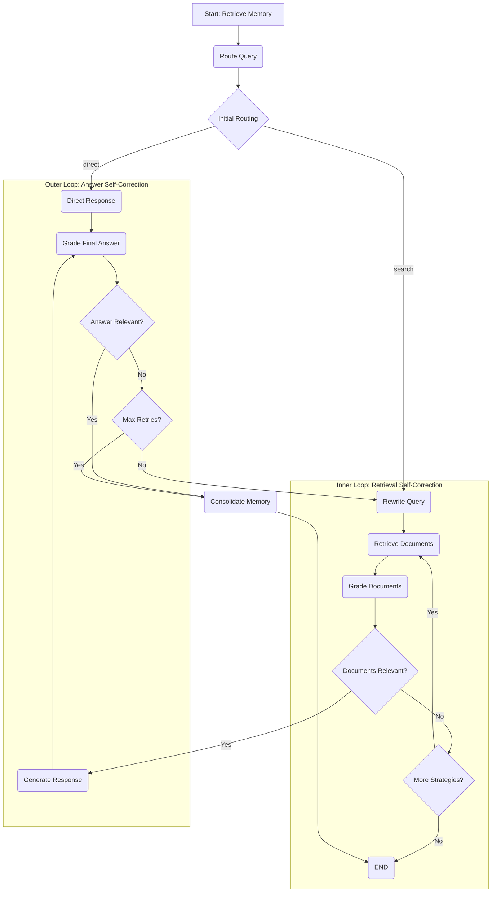

# Agentic RAG 系统工作流程详解 (v2 - 双循环架构)

## 1. 概述

本文档详细描述了 Agentic RAG 问答系统的内部工作流程。系统基于 LangGraph 构建，其核心是一个状态图（State Graph），通过一系列功能节点（Node）和条件边（Conditional Edge）的组合，实现对用户问题的智能分析、检索、生成和自我修正。

**v2架构核心思想：双循环（Dual-Loop）系统**

为提升系统的鲁棒性和效率，新架构引入了“内外双循环”机制：

1.  **内循环 (Retrieval Self-Correction)**: 一个快速、低成本的“检索-评估-重试”循环。在调用昂贵的LLM生成答案**之前**，系统会先对检索到的文档进行相关性评估。如果文档质量不佳，系统会自动切换检索策略并重试，确保“原材料”的质量。
2.  **外循环 (Answer Self-Correction)**: 在文档质量达标并生成答案后，系统会启动外循环，对最终答案进行评估。如果答案不解决问题，系统会尝试修正性地重写查询，并重新进入整个流程。

这种设计避免了基于低质量文档的无效计算，并赋予了系统在两个层面上的自我纠正能力。

## 2. 核心节点 (Nodes)

| 节点名称 | 功能描述 |
| --- | --- |
| `retrieve_memory_node` | **检索长期记忆**：流程入口。从长期记忆库检索历史信息，为后续决策提供背景。 |
| `route_query_node` | **智能路由决策**：系统的“大脑”。根据问题和记忆，仅负责决定一个**初始**的最佳检索策略（`route`），但**不执行**检索。 |
| `rewrite_query_node` | **查询重写**：优化用户问题，使其更适合检索。分为“初始重写”和“纠错性重写”两种模式。 |
| `retrieve_documents_node` | **文档检索 (内循环核心)**：根据当前`route`策略执行检索（本地或网络）。当内循环触发重试时，此节点会被反复调用。 |
| `grade_documents_node` | **文档相关性评估 (内循环核心)**：评估检索到的文档是否足以回答问题，是内循环的决策依据。 |
| `generate_response_node` | **生成答案**：在内循环确认文档质量后，调用 LLM，根据高质量的上下文生成最终答案。 |
| `direct_response_node` | **直接回答**：当问题无需检索时，直接调用 LLM 回答。 |
| `grade_relevance_node` | **答案相关性评估 (外循环核心)**：评估最终生成的答案是否解决了用户问题，是外循环的决策依据。 |
| `consolidate_memory_node`| **复盘并巩固记忆**：在流程成功结束后，提炼并存储本次问答的核心内容到长期记忆库。 |

## 3. 工作流详解

---

### **第一步: 记忆检索 (`retrieve_memory`)**
- **触发**: 系统接收到用户问题。
- **动作**: 调用 `retrieve_memory_node`，检索相关历史记忆，并初始化各种状态（如重试计数器）。
- **流向**: `route_query`。

---

### **第二步: 智能路由决策 (`route_query`)**
- **触发**: 上一步完成。
- **动作**: `route_query_node` 仅做决策，它分析问题和记忆，确定一个**初始**检索策略（`route`），如 `hierarchical_search`，并初始化 `tried_routes` 列表。
- **流向**: 根据 `route` 结果进行条件分发。如果需要检索，流向 `rewrite_query`；如果是 `direct`，则流向 `direct_response`。

---

### **第三步: 查询重写 (`rewrite_query`)**
- **触发**: 路由决策需要进行检索。
- **动作**: `rewrite_query_node` 对问题进行优化，为检索做准备。
- **流向**: `retrieve_documents`。

---

### **第四步: 内循环 - 检索与评估**

这是系统的第一个自省循环，目标是确保文档质量。

1.  **`retrieve_documents_node`**: 
    - **触发**: `rewrite_query` 完成，或内循环重试。
    - **动作**: 根据当前状态中的 `route` 值（例如 `hierarchical_search`），执行相应的检索操作。它还会处理“本地检索无果则自动转网络搜索”的逻辑。
    - **流向**: `grade_documents`。

2.  **`grade_documents_node`**: 
    - **触发**: 文档检索完成。
    - **动作**: 调用 `get_document_relevance_grader_chain`，评估 `documents` 列表与问题的相关性，并将结果（`True` 或 `False`）存入 `documents_are_relevant` 状态。
    - **流向**: “文档评估决策”条件边。

3.  **文档评估决策 (Conditional Edge)**:
    - **触发**: `grade_documents` 完成。
    - **决策** (`decide_after_document_grading` 函数):
        - **如果 `documents_are_relevant` 为 `True`**: 评估通过。决策为 `generate`，流程跳出内循环，走向 `generate_response_node`。
        - **如果为 `False`**: 评估失败。系统检查 `tried_routes` 列表，从 `['hierarchical_search', 'direct_chunk_search', 'web_search']` 中寻找一个尚未尝试的策略。
            - **如果找到新策略**: 更新状态中的 `route` 和 `tried_routes`，决策为 `retry_retrieve`，流程**循环回到 `retrieve_documents_node`**，使用新策略重试。
            - **如果所有策略都已尝试**: 说明无法找到相关文档，触发**熔断**。决策为 `fallback`，流程直接走向 `END`。

---

### **第五步: 答案生成 (`generate_response`)**
- **触发**: 内循环成功完成，确认文档质量合格。
- **动作**: `generate_response_node` 结合高质量的 `documents` 和 `updated_query`，让 LLM 生成答案。
- **流向**: `grade_relevance`。

---

### **第六步: 外循环 - 答案评估与修正**

这是系统的第二个自省循环，目标是确保最终答案的质量。

1.  **`grade_relevance_node`**: 
    - **触发**: `generate_response_node` 或 `direct_response_node` 完成。
    - **动作**: 调用 `get_relevance_grader_chain`，评估 `response` 是否解决了用户问题，更新 `is_relevant` 状态。
    - **流向**: “答案评估决策”条件边。

2.  **答案评估决策 (Conditional Edge)**:
    - **触发**: `grade_relevance` 完成。
    - **决策** (`decide_after_answer_grading` 函数):
        - **如果 `is_relevant` 为 `True`**: 答案合格。决策为 `end`，流程走向 `consolidate_memory`。
        - **如果为 `False`**: 答案不合格。检查重试次数 `correction_attempts`。
            - **如果次数未达上限 (2次)**: 决策为 `retry`，流程**循环回到 `rewrite_query_node`**，启动一次“纠错性重写”，并重新进入整个检索和生成流程。
            - **如果达到上限**: 触发**熔断**。决策为 `end`，流程走向 `consolidate_memory`。

---

### **第七步: 记忆巩固与结束**
- **触发**: 外循环决策为 `end`。
- **动作**: `consolidate_memory_node` 总结本次成功的（或最终失败的）问答，并可能存入长期记忆。
- **流向**: `END`，流程结束。